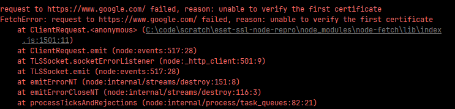
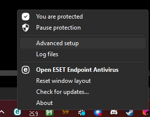
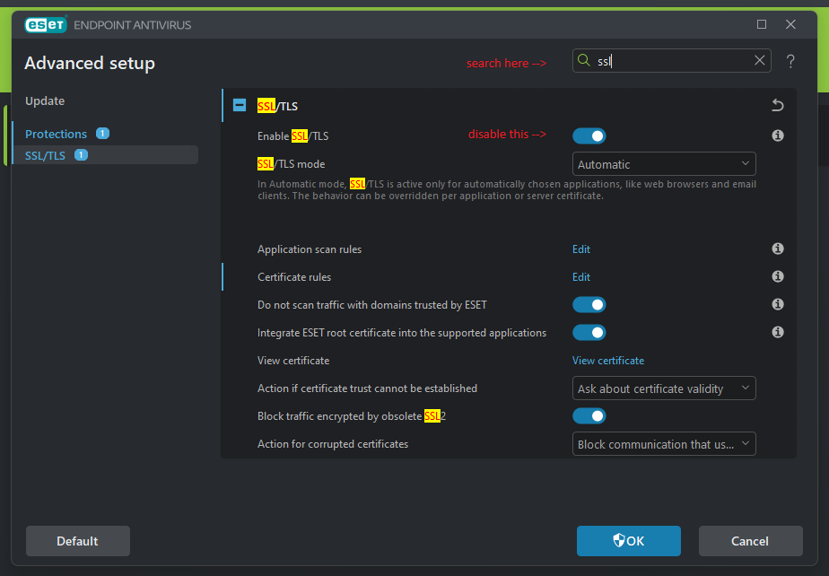

What is this?
---

A reproduction for the issue where ESET's SSL handling causes issues with node
processes attempting to communicate over ssl:

How to work around the issue:
---
Open Advanced setup:

Search for "SSL" and then disable the feature:

Now you won't get the error above.
